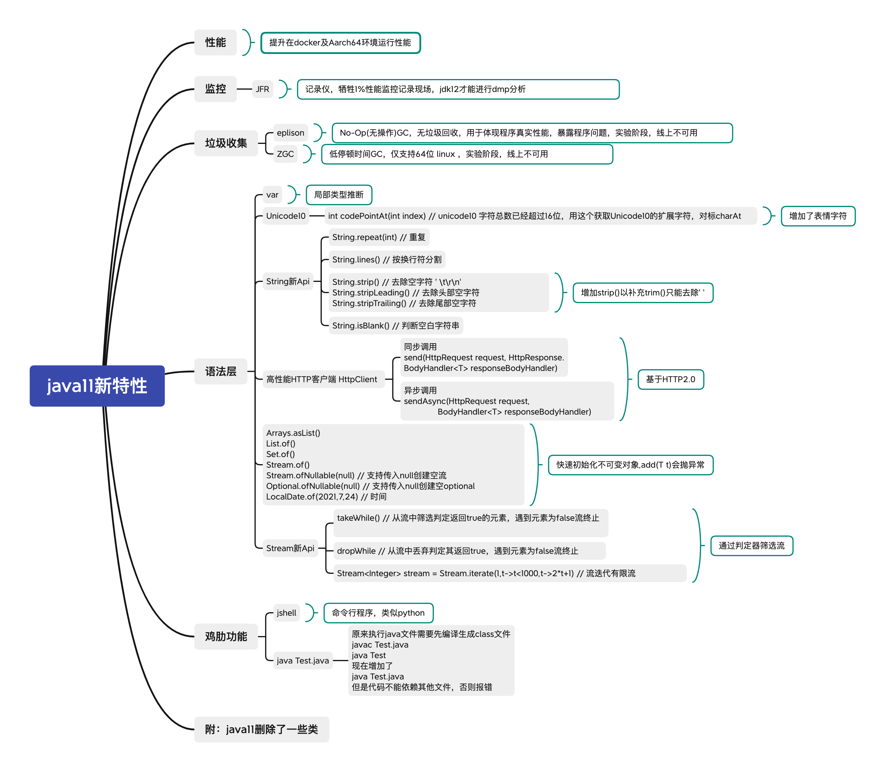

# Java11示例

此项目包含了Java8到Java11的部分升级特性示例.

- [var](src/main/java/com/company/var)
- [string](src/main/java/com/company/string)
- [collections](src/main/java/com/company/collections)
- [interface](src/main/java/com/company/interfaces)
- [http](src/main/java/com/company/http)
- [processor](src/main/java/com/company/processor)
- [try with resources](src/main/java/com/company/trywithresources)
- [files](src/main/java/com/company/files)
- [time](src/main/java/com/company/time)
- [single file](src/main/java/com/company/singlefile)
- 源文件java11_features.xmind
